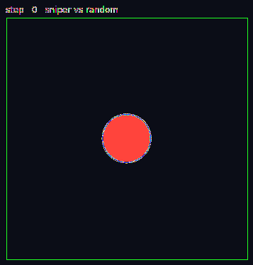

# Orbit Wars



Agent development for the Kaggle [Orbit Wars](https://www.kaggle.com/competitions/orbit-wars) competition — a real-time strategy game where 2 or 4 AI agents compete to conquer planets orbiting a central sun.

- **Prize**: $50,000 USD
- **Deadline**: 2026-06-23
- **Submission**: a `main.py` with an `agent(obs)` function returning `[[from_planet_id, angle, num_ships], ...]`

Players start with one home planet and launch fleets to capture neutral and enemy planets. Planets produce 1–5 ships/turn (inner ones orbit the sun, outer ones are static). Fleet speed scales log-style with size; fleets crossing the sun are destroyed. Comets spawn at steps 50/150/250/350/450 as temporary extra planets. The game ends at step 500 or when only one player is left — most total ships (on planets + in flight) wins.

## Quickstart

```bash
pip install -r requirements.txt

python run.py --mode play --agents sniper random   # play a match
python -m app.server                                # interactive dashboard
python run.py --mode submit --agents sniper        # pack and submit to Kaggle
```

*GIF above: baseline sniper (blue) vs random (red), seed 42.*
